# MVP Veri Modeli

Bu doküman LibreUniversity MVP kapsamındaki temel veri varlıklarını, ilişkileri, veri sahipliğini ve ilk iş kurallarını tanımlar. Amaç, geliştirme başlamadan önce OBS, LMS, kimlik, audit ve bildirim çekirdeğinin ortak dilini oluşturmaktır.

## Modelleme İlkeleri

- Her ana veri türünün kaynak sistemi açık olmalıdır.
- Kritik işlemler audit log ile izlenmelidir.
- Yetki kontrolleri veri modeliyle desteklenmelidir.
- Dış sistem kimlikleri çekirdek modele gömülmeden ayrı alanlarda tutulmalıdır.
- Kişisel veriler asgari düzeyde tutulmalı ve hassas veri alanları sınıflandırılmalıdır.
- İlk MVP modeli genişlemeye açık, fakat gereksiz ayrıntıdan arındırılmış olmalıdır.
- Kişi (`User`) ile öğrencilik kaydı (`StudentRecord`) ayrıdır; bir kişinin birden fazla öğrencilik kaydı olabilir.
- Sonradan değiştirilmesi en pahalı ilişkiler (kişi-öğrencilik, kayıt-dönem, not-politika) MVP ekranları tek durumu varsaysa bile şemada baştan doğru kurulur.

## Ana Varlıklar

### Identity ve Yetki

| Varlık | Açıklama | Kaynak |
| --- | --- | --- |
| `User` | Sisteme giriş yapabilen gerçek kişi veya teknik hesap. | Kimlik Çekirdeği |
| `Role` | Öğrenci, akademisyen, danışman, idari kullanıcı, sistem yöneticisi gibi rol tanımı. | Kimlik Çekirdeği |
| `Permission` | Belirli bir işlemi yapma yetkisi. | Kimlik Çekirdeği |
| `RolePermission` | Rolün sahip olduğu izinlerin bağlantı kaydı. | Kimlik Çekirdeği |
| `UserRole` | Kullanıcının belirli kapsamda sahip olduğu rol. | Kimlik Çekirdeği |
| `OrganizationUnit` | Üniversite, fakülte, enstitü, yüksekokul, bölüm, merkez gibi organizasyon birimi. | Akademik Çekirdek |

### Akademik Çekirdek

| Varlık | Açıklama | Kaynak |
| --- | --- | --- |
| `AcademicTerm` | Akademik yıl ve dönem bilgisi. | Akademik Çekirdek |
| `Program` | Lisans, yüksek lisans, doktora veya sertifika programı. | Akademik Çekirdek |
| `StudentRecord` | Bir kişinin belirli bir programdaki öğrencilik kaydı (öğrenci numarası, müfredat, durum). | OBS |
| `AdvisorAssignment` | Öğrencilik kaydına atanmış danışman ve geçerlilik aralığı. | OBS |
| `Instructor` | Akademisyenin öğretim elemanı kimliği. | Akademik Çekirdek |
| `Course` | Ders katalog kaydı. | Akademik Çekirdek |
| `Curriculum` | Bir programın müfredat tanımı. | OBS |
| `CurriculumCourse` | Müfredat içindeki ders ve dönem ilişkisi. | OBS |
| `CourseSection` | Belirli dönemde açılan ders şubesi. | OBS |
| `SectionMeeting` | Şubenin haftalık ders saati ve derslik bilgisi; çakışma kontrolünün temeli. | OBS |
| `TermRegistration` | Öğrencinin bir dönem için hazırladığı ders listesi ve danışman onay durumu. | OBS |
| `Enrollment` | Dönemlik kayıt içindeki tek bir şube satırı. | OBS |
| `GradeItem` | Ara sınav, final, ödev gibi değerlendirme kalemi. | OBS |
| `Grade` | Öğrencinin bir değerlendirme kalemindeki puanı. | OBS |
| `GradingPolicy` | Sürümlenen değerlendirme politikası: harf notu tablosu, ağırlıklar, geçme koşulları. | OBS |
| `CourseResult` | Kayıt bazında hesaplanan ders sonu notu, harf notu ve başarı durumu. | OBS |

### LMS Çekirdeği

| Varlık | Açıklama | Kaynak |
| --- | --- | --- |
| `CoursePage` | Şubeye bağlı LMS ders alanı. | LMS |
| `LearningMaterial` | PDF, video, bağlantı veya metin materyali. | LMS |
| `Assignment` | Ödev tanımı, teslim tarihi ve değerlendirme kuralı. | LMS |
| `AssignmentSubmission` | Öğrencinin ödev teslim kaydı. | LMS |
| `LiveSession` | Jitsi canlı ders oturumu. | LMS |
| `StoredFile` | Dosya ve medya varlıklarının metadata kaydı. | Dosya Servisi |

### Sistem Çekirdeği

| Varlık | Açıklama | Kaynak |
| --- | --- | --- |
| `AuditLog` | Kritik işlem denetim kaydı. | Audit Çekirdeği |
| `Notification` | Kullanıcıya gönderilecek bildirim kaydı. | Bildirim Servisi |
| `ExternalIdentity` | SSO, YÖKSİS, ÖSYM veya diğer dış sistem kimlik eşleşmeleri. | Entegrasyon Katmanı |

## ER Diyagramı

```mermaid
erDiagram
    USER {
        uuid id PK
        string username
        string email
        string display_name
        string status
        datetime created_at
        datetime updated_at
    }

    ROLE {
        uuid id PK
        string code
        string name
        string description
    }

    PERMISSION {
        uuid id PK
        string code
        string description
    }

    ROLE_PERMISSION {
        uuid id PK
        uuid role_id FK
        uuid permission_id FK
    }

    USER_ROLE {
        uuid id PK
        uuid user_id FK
        uuid role_id FK
        uuid organization_unit_id FK
        datetime valid_from
        datetime valid_until
    }

    ORGANIZATION_UNIT {
        uuid id PK
        uuid parent_id FK
        string type
        string code
        string name
        string status
    }

    ACADEMIC_TERM {
        uuid id PK
        string academic_year
        string term_type
        date starts_on
        date ends_on
        string status
    }

    PROGRAM {
        uuid id PK
        uuid organization_unit_id FK
        string code
        string name
        string level
        int duration_terms
        string status
    }

    STUDENT_RECORD {
        uuid id PK
        uuid user_id FK
        uuid program_id FK
        uuid curriculum_id FK
        uuid primary_record_id FK
        string student_number
        string record_type
        string status
        date admission_date
        date ended_on
        string end_reason
    }

    ADVISOR_ASSIGNMENT {
        uuid id PK
        uuid student_record_id FK
        uuid instructor_id FK
        date valid_from
        date valid_until
    }

    INSTRUCTOR {
        uuid id PK
        uuid user_id FK
        uuid organization_unit_id FK
        string employee_number
        string title
        string status
    }

    COURSE {
        uuid id PK
        uuid organization_unit_id FK
        string code
        string name
        decimal ects
        string language
        string status
    }

    CURRICULUM {
        uuid id PK
        uuid program_id FK
        string code
        string name
        date effective_from
        string status
    }

    CURRICULUM_COURSE {
        uuid id PK
        uuid curriculum_id FK
        uuid course_id FK
        int recommended_term
        string requirement_type
    }

    COURSE_SECTION {
        uuid id PK
        uuid course_id FK
        uuid academic_term_id FK
        uuid instructor_id FK
        uuid grading_policy_id FK
        string section_code
        int capacity
        string status
    }

    SECTION_MEETING {
        uuid id PK
        uuid course_section_id FK
        int weekday
        time starts_at
        time ends_at
        string room
    }

    TERM_REGISTRATION {
        uuid id PK
        uuid student_record_id FK
        uuid academic_term_id FK
        string status
        string advisor_note
        datetime submitted_at
        datetime approved_at
    }

    ENROLLMENT {
        uuid id PK
        uuid term_registration_id FK
        uuid student_record_id FK
        uuid course_section_id FK
        string status
        datetime requested_at
        datetime approved_at
    }

    GRADING_POLICY {
        uuid id PK
        uuid organization_unit_id FK
        string code
        int version
        string grading_mode
        json letter_grade_table
        json item_weights
        decimal pass_threshold
        decimal final_min_score
        date effective_from
        string status
    }

    GRADE_ITEM {
        uuid id PK
        uuid course_section_id FK
        string name
        string type
        decimal weight
        decimal max_score
    }

    GRADE {
        uuid id PK
        uuid enrollment_id FK
        uuid grade_item_id FK
        decimal score
        string status
    }

    COURSE_RESULT {
        uuid id PK
        uuid enrollment_id FK
        uuid grading_policy_id FK
        decimal final_score
        string letter_grade
        boolean passed
        datetime finalized_at
        string status
    }

    COURSE_PAGE {
        uuid id PK
        uuid course_section_id FK
        string title
        string visibility
    }

    LEARNING_MATERIAL {
        uuid id PK
        uuid course_page_id FK
        uuid stored_file_id FK
        string title
        string type
        int week_no
        string visibility
    }

    ASSIGNMENT {
        uuid id PK
        uuid course_page_id FK
        string title
        datetime opens_at
        datetime due_at
        decimal max_score
    }

    ASSIGNMENT_SUBMISSION {
        uuid id PK
        uuid assignment_id FK
        uuid student_record_id FK
        uuid stored_file_id FK
        datetime submitted_at
        string status
    }

    LIVE_SESSION {
        uuid id PK
        uuid course_page_id FK
        uuid instructor_id FK
        string provider
        string room_id
        datetime starts_at
        datetime ends_at
        string status
    }

    STORED_FILE {
        uuid id PK
        string storage_key
        string file_name
        string mime_type
        bigint size_bytes
        string checksum
    }

    AUDIT_LOG {
        uuid id PK
        uuid actor_user_id FK
        string action
        string entity_type
        uuid entity_id
        datetime occurred_at
        string ip_address
        string reason
        string before_summary
        string after_summary
    }

    NOTIFICATION {
        uuid id PK
        uuid recipient_user_id FK
        string channel
        string subject
        string status
        datetime created_at
    }

    EXTERNAL_IDENTITY {
        uuid id PK
        uuid user_id FK
        string provider
        string external_id
        datetime linked_at
    }

    USER ||--o{ USER_ROLE : has
    ROLE ||--o{ USER_ROLE : assigned
    ROLE ||--o{ ROLE_PERMISSION : grants
    PERMISSION ||--o{ ROLE_PERMISSION : granted_via
    ORGANIZATION_UNIT ||--o{ USER_ROLE : scopes
    ORGANIZATION_UNIT ||--o{ ORGANIZATION_UNIT : contains
    ORGANIZATION_UNIT ||--o{ PROGRAM : owns
    ORGANIZATION_UNIT ||--o{ COURSE : offers
    ORGANIZATION_UNIT ||--o{ INSTRUCTOR : employs

    USER ||--o{ STUDENT_RECORD : holds
    USER ||--o| INSTRUCTOR : maps_to
    USER ||--o{ EXTERNAL_IDENTITY : links

    PROGRAM ||--o{ STUDENT_RECORD : enrolls
    CURRICULUM ||--o{ STUDENT_RECORD : governs
    STUDENT_RECORD ||--o{ ADVISOR_ASSIGNMENT : advised_by
    INSTRUCTOR ||--o{ ADVISOR_ASSIGNMENT : advises
    PROGRAM ||--o{ CURRICULUM : defines
    CURRICULUM ||--o{ CURRICULUM_COURSE : includes
    COURSE ||--o{ CURRICULUM_COURSE : appears_in

    COURSE ||--o{ COURSE_SECTION : opens
    ACADEMIC_TERM ||--o{ COURSE_SECTION : schedules
    INSTRUCTOR ||--o{ COURSE_SECTION : teaches
    COURSE_SECTION ||--o{ SECTION_MEETING : meets
    STUDENT_RECORD ||--o{ TERM_REGISTRATION : prepares
    ACADEMIC_TERM ||--o{ TERM_REGISTRATION : covers
    TERM_REGISTRATION ||--o{ ENROLLMENT : lists
    STUDENT_RECORD ||--o{ ENROLLMENT : requests
    COURSE_SECTION ||--o{ ENROLLMENT : receives

    COURSE_SECTION ||--o{ GRADE_ITEM : evaluates
    ENROLLMENT ||--o{ GRADE : receives
    GRADE_ITEM ||--o{ GRADE : records
    ORGANIZATION_UNIT ||--o{ GRADING_POLICY : defines
    GRADING_POLICY ||--o{ COURSE_SECTION : governs
    ENROLLMENT ||--o| COURSE_RESULT : concludes
    GRADING_POLICY ||--o{ COURSE_RESULT : computed_with

    COURSE_SECTION ||--o| COURSE_PAGE : has
    COURSE_PAGE ||--o{ LEARNING_MATERIAL : contains
    COURSE_PAGE ||--o{ ASSIGNMENT : includes
    COURSE_PAGE ||--o{ LIVE_SESSION : hosts
    STORED_FILE ||--o{ LEARNING_MATERIAL : backs
    STORED_FILE ||--o{ ASSIGNMENT_SUBMISSION : backs
    ASSIGNMENT ||--o{ ASSIGNMENT_SUBMISSION : receives
    STUDENT_RECORD ||--o{ ASSIGNMENT_SUBMISSION : submits
    INSTRUCTOR ||--o{ LIVE_SESSION : moderates

    USER ||--o{ AUDIT_LOG : performs
    USER ||--o{ NOTIFICATION : receives
```

## Varlık Detayları

### `User`

Sistemde kimliği doğrulanabilen ana kullanıcı kaydıdır. Öğrenci, akademisyen ve idari personel rolleri bu kayıt üzerinden temsil edilir.

Temel alanlar:

- `id`
- `username`
- `email`
- `display_name`
- `status`
- `created_at`
- `updated_at`

Notlar:

- Parola doğrudan bu modelde tutulmamalıdır; SSO/kimlik sağlayıcıya bırakılmalıdır.
- Teknik kullanıcılar için ayrıca hesap tipi eklenebilir.

### `Role`, `Permission`, `RolePermission`, `UserRole`

Yetkilendirme modelinin çekirdeğidir. Rol ile izin ilişkisi `RolePermission` bağlantı kaydıyla tutulur; kullanıcıya rol ataması `UserRole` ile yapılır ve bir organizasyon birimiyle sınırlandırılabilir.

Örnekler:

- `student`
- `instructor`
- `advisor`
- `department_admin`
- `system_admin`

İlkeler:

- Yetkiler kodla sabitlenmiş varsayımlara değil, açık permission kayıtlarına dayanmalıdır.
- Kullanıcının birden fazla rolü olabilir.
- Rol ataması süreli olabilir.

### `OrganizationUnit`

Üniversite hiyerarşisini tutar.

Örnek tipler:

- `university`
- `faculty`
- `institute`
- `school`
- `department`
- `research_center`

İlkeler:

- Yetki kapsamı için temel referanslardan biridir.
- Fakülte/bölüm bazlı raporlama bu hiyerarşiye dayanır.

### `AcademicTerm`

Akademik yıl ve dönem bilgisidir.

Örnek:

- `2026-2027 Fall`
- `2026-2027 Spring`
- `2026 Summer`

İlkeler:

- Ders açma, ders kayıt, not girişi ve LMS sayfaları dönemle ilişkilidir.
- Bir dönem kapatıldıktan sonra kritik işlemler ek yetki gerektirmelidir.

### `Program`, `Curriculum`, `CurriculumCourse`

Program ve müfredat yapısını temsil eder.

İlkeler:

- Bir programın birden fazla müfredat sürümü olabilir.
- Öğrencinin hangi müfredat sürümüne tabi olduğu ayrıca takip edilebilir.
- MVP'de ön koşul modeli basitleştirilebilir; sonraki fazda ayrı `CoursePrerequisite` varlığı eklenebilir.

### `StudentRecord`

Bir kişinin belirli bir programdaki öğrencilik kaydını temsil eder. Kişi (`User`) ile öğrencilik kaydı bilinçli olarak ayrılmıştır: aynı kişi lisansı bitirip yüksek lisansa başlayabilir, çift anadal veya yandal yapabilir, kaydı silinip yeniden kayıt olabilir. Bu durumların her biri ayrı bir `StudentRecord` kaydıdır ve her kaydın kendi öğrenci numarası vardır.

Temel alanlar:

- `user_id`, `program_id`, `curriculum_id`
- `student_number`
- `record_type`: `major`, `double_major`, `minor`
- `primary_record_id`: çift anadal ve yandal kayıtlarında bağlı olduğu anadal kaydı (isteğe bağlı)
- `status`, `admission_date`, `ended_on`, `end_reason`

İlkeler:

- `Enrollment`, `TermRegistration`, `CourseResult` ve `AssignmentSubmission` kişiye değil öğrencilik kaydına bağlanır; transkript kayıt bazında üretilir.
- MVP ekranları tek aktif öğrencilik kaydı varsayabilir; şema bu varsayıma kilitlenmez.
- Öğrencinin tabi olduğu müfredat sürümü `curriculum_id` ile kayıt üzerinde tutulur.
- Saklama süreleri öğrencilik kaydı bazında yönetilebilir (KVKK).

### `AdvisorAssignment`

Öğrencilik kaydına atanmış danışmanı ve geçerlilik aralığını tutar.

İlkeler:

- Danışmanlık yalnızca birim kapsamlı bir rol olarak modellenmez; aksi halde bölümdeki her danışman her öğrencinin kaydını onaylayabilir.
- Dönemlik kayıt onayı yalnızca o tarihte geçerli atamanın danışmanı tarafından yapılabilir.
- Aynı anda birden fazla geçerli atama olamaz.

### `Instructor`

Kullanıcının akademisyen/öğretim elemanı kimliğini temsil eder.

İlkeler:

- Her akademisyen bir `User` kaydına bağlıdır.
- Akademisyen bir veya daha fazla ders şubesinde eğitmen olabilir.
- Danışmanlık `AdvisorAssignment` ile öğrencilik kaydı bazında atanır.

### `Course` ve `CourseSection`

`Course` katalogdaki soyut ders kaydıdır. `CourseSection` ise belirli dönemde açılan şubedir.

Örnek:

- `Course`: BLG101 Algoritmaya Giriş
- `CourseSection`: 2026 Fall, BLG101-A, kapasite 80

İlkeler:

- Öğrenci doğrudan `Course` kaydına değil, `CourseSection` kaydına kayıt olur.
- Kapasite, dönem, akademisyen, değerlendirme politikası ve durum şube üzerinde tutulur.
- MVP'de her şubenin tek sorumlu eğitmeni vardır; ortak yürütülen dersler için `SectionInstructor` MVP sonrası adaydır.

### `SectionMeeting`

Şubenin haftalık ders saatlerini tutar: `weekday`, `starts_at`, `ends_at`, `room`. Bir şubenin birden fazla oturumu olabilir.

İlkeler:

- Ders kayıt sırasındaki saat çakışması kontrolü bu kayıtlar üzerinden yapılır.
- MVP'de derslik serbest metindir; mekan yönetimi ayrı modülde ele alınır.

### `TermRegistration`

Öğrencinin bir dönem için hazırladığı ders listesinin başlığıdır. Türkiye pratiğinde öğrenci listeyi bütün olarak gönderir, danışman bütün olarak onaylar ya da notla geri gönderir.

Durumlar:

- `draft`
- `submitted`
- `returned`
- `approved`

İlkeler:

- Dönemlik AKTS üst ve alt sınırı gibi toplam kuralları bu başlıkta kontrol edilir.
- `advisor_note` geri gönderme gerekçesini taşır.
- Onay sonrası ekleme ve çıkarma ayrı bir ders ekle/bırak dönemi kuralına tabidir; MVP'de listenin yeniden `submitted` durumuna alınması yeterlidir.

### `Enrollment`

Öğrencinin ders şubesine kayıt durumunu temsil eder.

`Enrollment` bir `TermRegistration` içindeki tek şube satırıdır; onay akışı satır bazında değil dönemlik kayıt bazında yürür.

Örnek durumlar:

- `listed`: dönemlik kayıt listesinde, henüz onaylanmamış
- `approved`: dönemlik kayıt onaylandı
- `rejected`: danışman veya kural tarafından reddedildi
- `withdrawn`: öğrenci çekildi
- `dropped`: idari olarak silindi

İlkeler:

- Aynı öğrencilik kaydı aynı dönemde aynı dersin birden fazla aktif şubesine kayıt olamamalıdır.
- Kontenjan, ön koşul ve saat çakışması satır eklenirken kontrol edilir; AKTS toplamı dönemlik kayıt gönderilirken kontrol edilir.
- Her durum değişikliği audit log'a yazılmalıdır.

### `GradeItem`, `Grade`, `GradingPolicy` ve `CourseResult`

`GradeItem` şubenin değerlendirme kalemlerini, `Grade` öğrencinin tek bir kalemdeki puanını, `CourseResult` ise kayıt bazında hesaplanan ders sonu notunu temsil eder. Harf notu ve başarı durumu kalem notu üzerinde değil, `CourseResult` üzerinde tutulur.

Örnek `GradeItem` tipleri:

- `midterm`
- `final`
- `assignment`
- `project`
- `makeup`

`GradingPolicy`, her üniversitenin ve fakültenin farklı yönetmeliğini kod değiştirmeden uygulamak için sürümlenen parametrik politikadır:

- `organization_unit_id`: politikanın tanımlandığı birim (üniversite, fakülte veya enstitü)
- `code`, `version`, `effective_from`, `status`
- `grading_mode`: `absolute` veya `relative`
- `letter_grade_table`: harf notu aralıkları ve katsayıları
- `item_weights`: kalem tiplerinin varsayılan ağırlıkları
- `pass_threshold`, `final_min_score`: geçme notu ve final alt sınırı

İlkeler:

- Her şube bir `GradingPolicy` sürümüne bağlanır; kural değişse bile önceki dönemlerin sonuçları eski sürümle açıklanabilir kalır.
- `CourseResult.grading_policy_id` sonucun hangi politika sürümüyle hesaplandığını saklar; "hesaplama kuralı izlenebilir olmalı" ilkesi bu alanla sağlanır.
- Bağıl değerlendirme algoritması açık ve belgeli olmalıdır; MVP'de mutlak değerlendirme yeterlidir, bağıl mod sonraki fazda uygulanır.
- Kural motoru veya DSL MVP kapsamı dışıdır; parametrik politika yeterlidir.
- Not girişi yalnızca yetkili akademisyen veya yetkili idari rol tarafından yapılmalıdır.
- Not değişiklikleri gerekçe ve audit log gerektirmelidir.
- Kalem notu değiştiğinde ders sonucu yeniden hesaplanır; önceki sonuç audit log'a yazılır.
- Her kayıt için en fazla bir aktif `CourseResult` bulunur.

### LMS Varlıkları

`CoursePage`, `LearningMaterial`, `Assignment`, `AssignmentSubmission` ve `LiveSession` LMS çekirdeğini oluşturur.

> [ADR-0013](docs/adr/0013-integrate-existing-lms-instead-of-building.md) kabul edilirse bu varlıklar MVP'de LibreUniversity içinde tutulmaz; yerlerini LMS entegrasyon kayıtları (şube-ders eşleştirmesi, senkronizasyon durumu, not aktarım kaydı) alır ve bu bölüm o kararla birlikte güncellenir.

İlkeler:

- LMS ders sayfası bir `CourseSection` kaydına bağlıdır.
- Materyaller ve ödev teslimleri `StoredFile` üzerinden dosya metadata kaydına bağlanır.
- Canlı ders sağlayıcısı adapter ile temsil edilir; çekirdek LMS Jitsi'ye doğrudan gömülmemelidir.

### `AuditLog`

Kritik işlemlerin değiştirilemez denetim kaydıdır.

Minimum kayıt alanları:

- İşlemi yapan kullanıcı.
- İşlem tipi.
- Etkilenen varlık tipi.
- Etkilenen varlık kimliği.
- Zaman.
- IP/adres veya istemci bilgisi.
- Önceki ve sonraki değer özeti (`before_summary`, `after_summary`).
- Gerekçe (`reason`); not değişikliği, kayıt iptali ve yetki değişikliği gibi işlemlerde zorunludur.

MVP'de özellikle şu işlemler loglanmalıdır:

- Giriş/çıkış.
- Rol ve yetki değişikliği.
- Ders kayıt başvurusu ve onayı.
- Not girişi ve not değişikliği.
- Dosya yükleme/silme.
- Canlı ders başlatma.

### `Notification`

Kullanıcıya gönderilecek bildirimleri tutar.

Kanallar:

- `in_app`
- `email`
- `sms`
- `push`

MVP'de yalnızca `in_app` ve `email` ile başlanabilir.

## Temel İş Kuralları

### Kimlik ve Yetki

- Her işlem kimliği doğrulanmış bir kullanıcı tarafından yapılmalıdır.
- Kritik işlemlerde yetki yalnızca rol adına göre değil, organizasyon birimi ve veri kapsamına göre de kontrol edilmelidir.
- Sistem yöneticisi yetkileri audit log dışında bırakılamaz.

### Ders Açma

- Her `CourseSection` bir `Course` ve bir `AcademicTerm` ile ilişkili olmalıdır.
- Kapasite negatif olamaz.
- Kapalı veya arşivlenmiş ders için yeni şube açılamaz.
- Aynı dönem içinde aynı ders için aynı şube kodu tekrar kullanılamaz.

### Ders Kayıt

- Öğrenci yalnızca aktif kayıt döneminde ders seçebilmelidir.
- Öğrencilik kaydı aynı dönemde aynı dersin birden fazla aktif şubesine kayıt olamamalıdır.
- Şube listeye eklenirken kontenjan, ön koşul ve `SectionMeeting` üzerinden saat çakışması kontrol edilir; çakışan şube eklenemez.
- Kontenjan doluysa kayıt bekleme listesine alınabilir veya reddedilebilir; MVP'de reddetme yeterlidir.
- Dönemlik kayıt gönderilirken müfredat ve politika kurallarına göre AKTS toplam sınırı kontrol edilir.
- Gönderilen dönemlik kayıt yalnızca geçerli `AdvisorAssignment` sahibi danışman tarafından onaylanabilir veya notla geri gönderilebilir.
- Onaylanan kayıt silinirse veya çekilirse audit log'a gerekçesiyle yazılmalıdır.

### Not Girişi

- Not yalnızca ilgili şubenin akademisyeni veya yetkili idari kullanıcı tarafından girilebilir.
- Dönem kapandıktan sonra not değişikliği ek yetki ve gerekçe gerektirmelidir.
- Harf notu ve başarı durumu `CourseResult` kaydına yazılmalı; kullanılan `GradingPolicy` sürümü sonuç üzerinde saklanmalıdır.
- Not değişikliği öğrencinin bildirim merkezine düşmelidir.

### LMS

- Her ders şubesinin en fazla bir aktif `CoursePage` kaydı olmalıdır.
- Öğrenci yalnızca kayıtlı olduğu şubenin materyal ve ödevlerini görebilmelidir.
- Ödev teslim tarihi geçtiyse teslim durumu geç teslim olarak işaretlenmelidir.
- Canlı ders odası yalnızca yetkili akademisyen tarafından başlatılmalıdır.

### Dosya ve Medya

- Dosyanın fiziksel saklama anahtarı `StoredFile` içinde tutulmalıdır.
- Dosya sahipliği, görünürlüğü ve kullanım yeri ayrı metadata ile izlenmelidir.
- Hassas dosyalar için erişim her indirme/görüntüleme işleminde kontrol edilmelidir.

## Veri Sahipliği

| Veri | Kaynak Sistem | Not |
| --- | --- | --- |
| Kullanıcı kimliği | Kimlik Çekirdeği / SSO | Parola çekirdek uygulamada tutulmaz. |
| Rol ve yetki | Kimlik Çekirdeği | Organizasyon kapsamı desteklenir. |
| Organizasyon birimi | Akademik Çekirdek | Fakülte/bölüm hiyerarşisi. |
| Program/ders/dönem | Akademik Çekirdek | OBS ve LMS tarafından kullanılır. |
| Öğrencilik kaydı ve danışman ataması | OBS | Kişi kaydı kimlik çekirdeğinde, öğrencilik OBS'de. |
| Ders kayıt | OBS | Dönemlik kayıt ve satırları; akademik kayıt için kaynak sistemdir. |
| Not ve ders sonucu | OBS | Kritik audit gerektirir; politika sürümüyle birlikte saklanır. |
| Değerlendirme politikası | OBS | Birim bazlı, sürümlenir. |
| Ders materyali | LMS | Dosya metadata ile ilişkilidir. |
| Canlı ders | LMS | Jitsi adapter ile yürütülür. |
| Dosya içeriği | Dosya Servisi | Nesne depolamada tutulur. |
| Audit log | Audit Çekirdeği | Değiştirilemezlik hedeflenir. |
| Bildirim | Bildirim Servisi | Kanal durumları ayrı izlenir. |

## Hassas Veri Sınıflandırması

| Sınıf | Örnek | Koruma |
| --- | --- | --- |
| Genel akademik veri | Ders adı, AKTS, şube kodu | Yetkili kullanıcılar görebilir. |
| Kişisel veri | Ad, e-posta, öğrenci numarası | KVKK kurallarına tabidir. |
| Akademik performans verisi | Not, devamsızlık, transkript | Sıkı rol ve kapsam kontrolü gerekir. |
| Güvenlik verisi | Audit log, IP, oturum bilgisi | Sadece yetkili denetim rolleri görebilir. |
| Dosya/veri içeriği | Ödev, belge, materyal | Sahiplik ve görünürlük kontrolü gerekir. |

## MVP Sonrası Genişletme Adayları

- `CoursePrerequisite`
- `SectionInstructor`
- `Room` ve mekan yönetimi (`SectionMeeting.room` yerine)
- `AttendanceSession`
- `AttendanceRecord`
- `Exam`
- `ExamRoom`
- `DocumentRequest`
- `Payment`
- `Scholarship`
- `DormApplication`
- `SupportTicket`
- `ConsentRecord`
- `DataRetentionPolicy`
- `IntegrationJob`
- `WebhookEvent`

Bu varlıklar MVP veri modeline şimdiden gömülmemeli; ancak genişleme noktaları tasarımda dikkate alınmalıdır.
