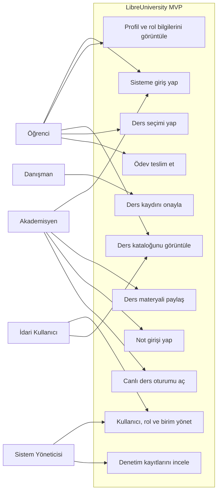
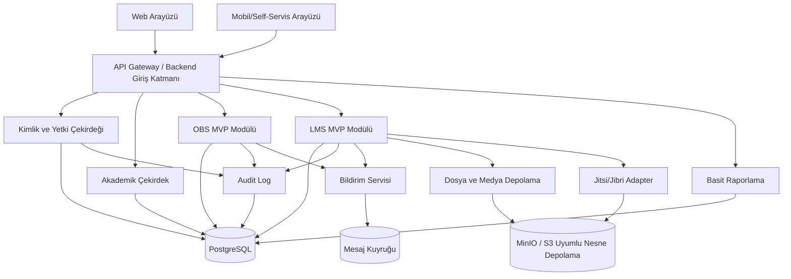
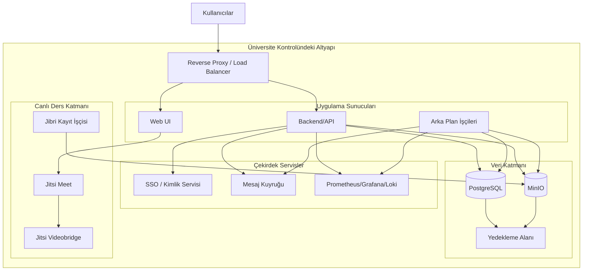
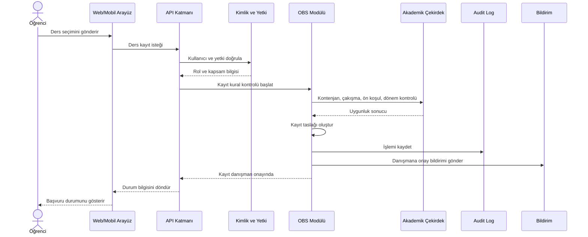
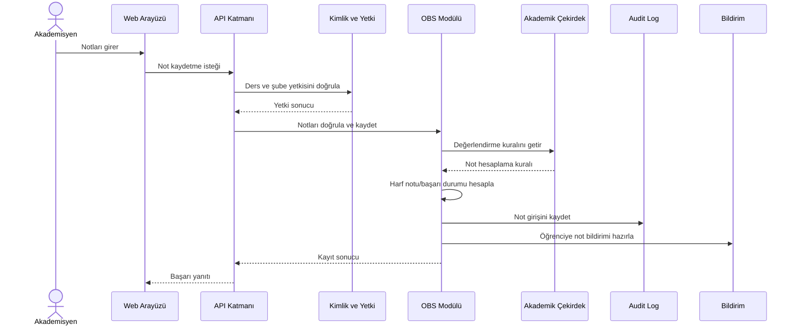
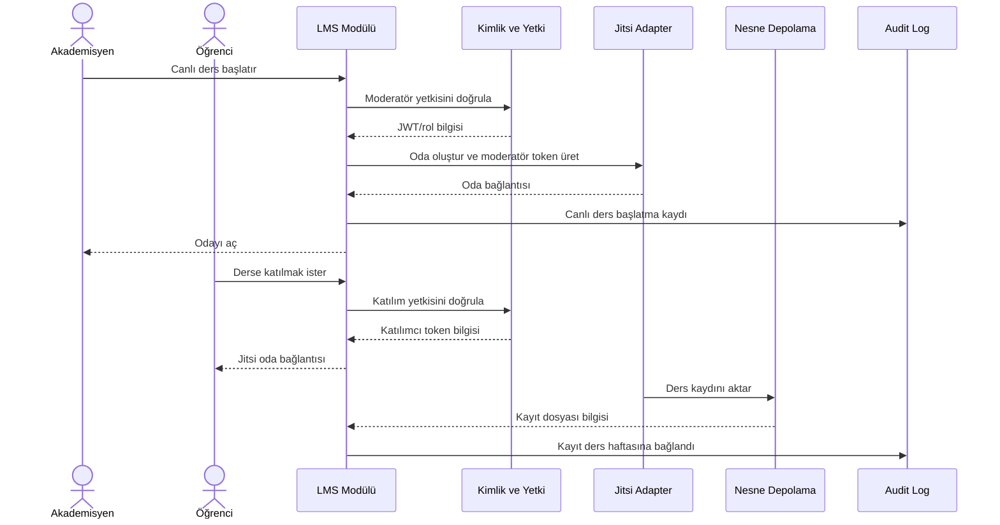

# MVP UML Diyagramları

Bu doküman LibreUniversity MVP kapsamı için ilk UML taslağını içerir. Diyagramlar geliştirme başlamadan önce sınırları netleştirmek, topluluk tartışmasını kolaylaştırmak ve ilk mimari kararları görünür yapmak için hazırlanmıştır.

## MVP Use Case Diyagramı

## MVP Component Diyagramı

## MVP Deployment Diyagramı

## Ders Kaydı Sequence Diyagramı

## Not Girişi Sequence Diyagramı

## Canlı Ders Sequence Diyagramı

## Açık Noktalar

- Kimlik sistemi doğrudan Keycloak ile mi başlayacak, yoksa daha ince bir kimlik çekirdeği mi yazılacak?
- MVP modüler monolith olarak mı başlayacak, yoksa SSO/OBS/LMS ayrı servisler mi olacak?
- Mobil uygulama ilk aşamada responsive web olarak mı ele alınacak?
- Ders kayıt kuyruğu MVP'de gerçek kuyruk sistemiyle mi, yoksa basitleştirilmiş işlem modeliyle mi gösterilecek?
- Jitsi kayıt/VOD pipeline ilk MVP'de tam çalışacak mı, yoksa adapter sınırıyla mı bırakılacak?
